# 🚀 Sistema de Procesamiento de Órdenes con AWS

[](https://aws.amazon.com/)
[](https://aws.amazon.com/lambda/)
[](https://aws.amazon.com/sqs/)
[](https://aws.amazon.com/dynamodb/)

> **Sistema serverless escalable** para procesar órdenes de manera asíncrona utilizando servicios AWS modernos.

## 📋 Tabla de Contenidos

- [🏗️ Arquitectura](#️-arquitectura)
- [🔄 Flujo de Procesamiento](#-flujo-de-procesamiento)
- [🎯 Decisiones de Diseño](#-decisiones-de-diseño)
- [🔧 Endpoints de Prueba](#-endpoints-de-prueba)
- [⚡ Características](#-características)
- [🚀 Cómo Probar](#-cómo-probar)

---

## 🏗️ Arquitectura

### Componentes del Sistema

| Componente | Descripción | Tecnología |
|------------|-------------|------------|
| **Canales de Entrada** | Interfaces para generar órdenes | Web, Mobile, ATM |
| **API Gateway** | Endpoints REST para órdenes y health-check | AWS API Gateway |
| **OrdersQueue** | Cola de mensajes para desacoplar procesamiento | AWS SQS |
| **OrdersProcessor** | Función serverless para validar y persistir | AWS Lambda |
| **OrdersBucket** | Almacenamiento de órdenes válidas | AWS S3 |
| **DynamoDB** | Base de datos NoSQL para metadatos | AWS DynamoDB |
| **CloudWatch** | Monitoreo y logs del sistema | AWS CloudWatch |
| **DLQ** | Cola para mensajes fallidos | AWS SQS |

### Diagrama de Arquitectura

```
┌─────────────┐    ┌─────────────┐    ┌─────────────┐
│   Web/Mobile│    │     ATM     │    │   Canales   │
│     Apps    │    │             │    │  Externos   │
└──────┬──────┘    └──────┬──────┘    └──────┬──────┘
       │                  │                  │
       └──────────────────┼──────────────────┘
                          │
                   ┌──────▼──────┐
                   │ API Gateway │
                   └──────┬──────┘
                          │
                   ┌──────▼──────┐
                   │ OrdersQueue │
                   │   (SQS)     │
                   └──────┬──────┘
                          │
                   ┌──────▼──────┐
                   │OrdersProcessor│
                   │   (Lambda)   │
                   └──────┬──────┘
                          │
              ┌───────────┼───────────┐
              │           │           │
         ┌────▼────┐ ┌────▼────┐ ┌────▼────┐
         │   S3    │ │DynamoDB │ │CloudWatch│
         │(JSON)   │ │(Metadata)│ │ (Logs)  │
         └─────────┘ └─────────┘ └─────────┘
```

---

## 🔄 Flujo de Procesamiento

### 1. Recepción de Orden
- **Canal de entrada**: La orden puede provenir de Web, Mobile o ATM
- **API Gateway**: Recibe la petición HTTP y la valida

### 2. Cola de Mensajes
- **SQS (OrdersQueue)**: Recibe la orden como mensaje
- **Lambda al dar error genera reintentos automaticos (10)**: delegarle los reitentos a Lambda con reintentos automáticos

### 3. Procesamiento Lambda

El **`processOrders.js`** es el motor central del sistema que procesa cada orden recibida desde SQS. Realiza las siguientes operaciones:

#### 🔍 **Validaciones de Entrada**
```javascript
// Valida que todos los campos requeridos estén presentes y sean correctos
const isAmountValid = typeof order.amount === "number" && !isNaN(order.amount);
const isFromAccountValid = typeof order.fromAccount === "string" && /^[0-9]+$/.test(order.fromAccount);
const isToAccountValid = typeof order.toAccount === "string" && /^[0-9]+$/.test(order.toAccount);
const isValid = order.id && isAmountValid && isFromAccountValid && isToAccountValid;
```

#### 🔄 **Detección de Duplicados**
- **Consulta DynamoDB**: Busca si ya existe una orden con el mismo `orderId`
- **Si es duplicada**: 
  - Marca `isDuplicate = true`
  - Genera un nuevo `id` único con UUID
  - Solo guarda en DynamoDB (no en S3)
- **Si es nueva**: 
  - Marca `isDuplicate = false`
  - Genera un nuevo `id` único con UUID

#### 💾 **Almacenamiento Inteligente**

```mermaid
graph TD
    A[Orden Recibida] --> B{Validar Campos}
    B -->|Válida| C{¿Es Duplicada?}
    B -->|Inválida| D[Marcar valid=false]
    C -->|No| E[Guardar en S3 + DynamoDB]
    C -->|Sí| F[Guardar solo en DynamoDB]
    D --> G[Guardar en DynamoDB]
    E --> H[Registrar en CloudWatch]
    F --> H
    G --> H
```


#### 📁 **Estrategia de Almacenamiento**
- **S3**: Solo órdenes válidas y no duplicadas → `orders/{orderId}.json`
- **DynamoDB**: Todas las órdenes (válidas, inválidas, duplicadas) con metadatos
- **CloudWatch**: Logs detallados de cada operación para auditoría

#### 🛡️ **Manejo de Errores**
- **Try-catch**: Captura errores individuales por cada orden
- **Logging detallado**: Registra cada paso del proceso
- **Reintentos**: SQS maneja reintentos automáticos si Lambda falla
- **DLQ**: Mensajes fallidos van a Dead Letter Queue después de 10 intentos

### 4. Almacenamiento
- **S3**: Solo órdenes válidas como JSON
- **DynamoDB**: Todos los registros con metadatos
- **CloudWatch**: Logs de eventos y errores

### 5. Manejo de Errores
- **DLQ (Dead Letter Queue)**: Captura mensajes fallidos después de múltiples intentos
- **Reintentos automáticos**: SQS maneja reintentos temporalmente fallidos

---

## 🎯 Decisiones de Diseño

### ✅ Ventajas de la Arquitectura Elegida

| Decisión | Razón | Beneficio |
|----------|-------|-----------|
| **Lambda vs EC2** | Serverless y escalable | Costo eficiente, sin gestión de servidores |
| **SQS** | Entrega confiable | Desacoplamiento, reintentos automáticos |
| **DLQ** | Captura errores persistentes | No pérdida de mensajes, análisis posterior |
| **S3** | Almacenamiento de órdenes válidas | Trazabilidad, descargas posteriores |
| **DynamoDB** | Base de datos NoSQL | Auditoría completa, consultas rápidas |

---

## 🔧 Endpoints de Prueba

### Base URL
```
https://xr2nykop37.execute-api.us-east-1.amazonaws.com/dev
```

### 1. 📤 Enviar Orden

**Endpoint:** `POST /orders`

**Ejemplo de Request:**
```bash
curl -X POST https://xr2nykop37.execute-api.us-east-1.amazonaws.com/dev/orders \
  -H "Content-Type: application/json" \
  -d '{
    "id": "order-001",
    "amount": 2580,
    "fromAccount": "1111111",
    "toAccount": "7777777"
  }'
```

**Body JSON:**
```json
{
  "id": "order-001",
  "amount": 2580,
  "fromAccount": "1111111",
  "toAccount": "7777777"
}
```

### 2. 📥 Obtener Orden

**Endpoint:** `GET /orders/{orderId}`

**Ejemplo:**
```bash
curl https://xr2nykop37.execute-api.us-east-1.amazonaws.com/dev/orders/order-001
```

### 3. 🏥 Health Check

**Endpoint:** `GET /health`

**Ejemplo:**
```bash
curl https://xr2nykop37.execute-api.us-east-1.amazonaws.com/dev/health
```

---

## ⚡ Características

### 🔐 Validaciones
- ✅ **Campos requeridos**: `id`, `amount`, `fromAccount`, `toAccount`
- ✅ **Detección de duplicados**: Genera `isDuplicate=true` para órdenes repetidas
- ✅ **Validación de monto**: Verifica que `amount` sea un número válido

### 📊 Almacenamiento
- **S3**: Solo órdenes válidas como archivos JSON
- **DynamoDB**: Todos los registros con campos `valid` e `isDuplicate`
- **CloudWatch**: Logs completos para monitoreo y debugging

### 🔄 Resiliencia
- **Reintentos automáticos**: SQS maneja fallos temporales
- **DLQ**: Captura errores persistentes sin pérdida de datos
- **Escalabilidad**: Sistema serverless que se adapta automáticamente

---

## 🚀 Cómo Probar

### Flujo Completo de Prueba

1. **📤 Enviar una orden**
   ```bash
   curl -X POST https://xr2nykop37.execute-api.us-east-1.amazonaws.com/dev/orders \
     -H "Content-Type: application/json" \
     -d '{"id": "test-001", "amount": 1000, "fromAccount": "123456", "toAccount": "789012"}'
   ```

2. **📥 Verificar la orden**
   ```bash
   curl https://xr2nykop37.execute-api.us-east-1.amazonaws.com/dev/orders/test-001
   ```

3. **🏥 Verificar estado del sistema**
   ```bash
   curl https://xr2nykop37.execute-api.us-east-1.amazonaws.com/dev/health
   ```

### Verificaciones Adicionales

- ✅ **DynamoDB**: Confirmar que la orden se guardó con `valid=true/false`
- ✅ **S3**: Verificar que el JSON esté disponible (solo órdenes válidas)
- ✅ **CloudWatch**: Revisar logs para eventos y errores
- ✅ **DLQ**: Monitorear mensajes fallidos si ocurren errores persistentes

---

## 📝 Notas Importantes

> **💡 Lambdas de Testeo**: Se incluyen dos lambdas adicionales (`Submit Orders` y `Get Orders`) únicamente para facilitar las pruebas del ambiente.

> **⚡ Escalabilidad**: El sistema es completamente serverless y se escala automáticamente según la demanda de órdenes entrantes.

> **🔍 Auditoría**: Todas las órdenes se registran en DynamoDB para auditoría completa, independientemente de su validez.

---

## 🤝 Contribución

Este proyecto está diseñado como un sistema de referencia para procesamiento de órdenes serverless en AWS. Para contribuir o reportar issues, por favor contacta al equipo de desarrollo.

---

<div align="center">

**Desarrollado con ❤️ usando AWS Serverless**

[](https://aws.amazon.com/)

</div>